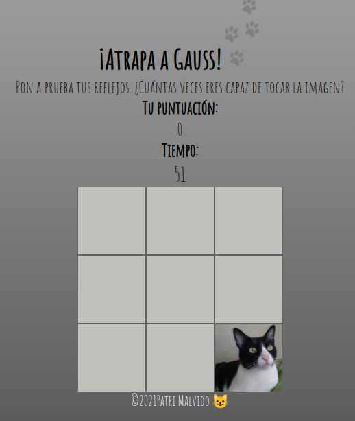

# Juego Atrapa a Gauss

## Descripción
Este juego consiste en intentar pulsar una foto de mi gatete Gauss todas las veces que puedas en un minuto.

Para probarlo haz click [aquí](https://patrimalvido.github.io/Atrapa-al-gato/) y lo verás en funcionamiento.

Es un ejercicio para practicar JavaScript.

